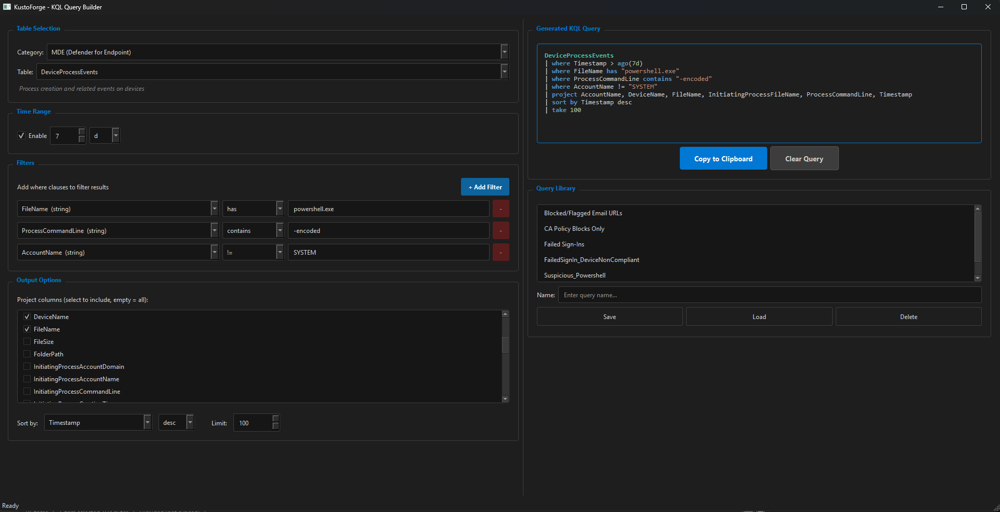

# KustoForge

A desktop KQL (Kusto Query Language) query builder for Microsoft security and Azure services. Build syntactically correct KQL queries through a form-based GUI instead of writing them from scratch.

Built for SOC analysts, security engineers, cloud admins, and anyone working with Microsoft's KQL-powered services.



## Features

- **Form-based query building** - Select a table, add filters, pick output columns, and get valid KQL
- **52 tables across 9 service categories** - Full coverage of the Microsoft KQL ecosystem
- **Smart operator selection** - Operators change based on column data type (string, int, datetime, bool, dynamic)
- **Live query preview** - See the KQL update in real-time as you fill out the form, with syntax highlighting
- **Query library** - Save, load, and manage named queries in a local JSON file
- **Copy to clipboard** - One click to copy the generated query
- **Dark theme** - Professional dark UI with Microsoft blue accents
- **Keyboard shortcuts** - Ctrl+Shift+C (copy), Ctrl+S (save), Ctrl+N (clear)

## Table Coverage

| Category | Tables | Examples |
|---|---|---|
| **MDE (Defender for Endpoint)** | 9 | DeviceProcessEvents, DeviceNetworkEvents, DeviceFileEvents, AlertInfo |
| **Identity (Entra ID)** | 4 | SigninLogs, AADSignInEventsBeta, IdentityLogonEvents |
| **Email (Defender for Office 365)** | 3 | EmailEvents, EmailAttachmentInfo, EmailUrlInfo |
| **Vulnerability Management** | 2 | DeviceTvmSoftwareVulnerabilities, DeviceTvmSoftwareInventory |
| **Microsoft Sentinel** | 11 | SecurityEvent, Syslog, CommonSecurityLog, SecurityAlert, SecurityIncident |
| **Azure Monitor / Log Analytics** | 9 | Heartbeat, Perf, Event, ContainerLog, KubeEvents, VMConnection |
| **Application Insights** | 8 | requests, exceptions, traces, dependencies, pageViews |
| **Azure Resource Graph** | 5 | Resources, ResourceContainers, SecurityResources, PolicyResources |
| **Defender for Cloud Apps** | 1 | CloudAppEvents |

## Supported KQL Operators

| Data Type | Operators |
|---|---|
| **string** | `==`, `!=`, `in`, `!in`, `contains`, `!contains`, `has`, `!has`, `startswith`, `endswith`, `matches regex` |
| **int** | `==`, `!=`, `in`, `!in`, `>`, `<`, `>=`, `<=`, `between` |
| **datetime** | `ago()`, `>`, `<`, `>=`, `<=`, `between` |
| **bool** | `==`, `!=` |
| **dynamic** | `contains`, `has`, `!has`, `array_length() >` |

## Installation

### Prerequisites

- Python 3.10 or higher
- pip (Python package manager)

### Option 1: Clone and Run (Recommended)

```bash
git clone https://github.com/ChrisHuber1/KustoForge.git
cd KustoForge
pip install -r requirements.txt
python main.py
```

### Option 2: Install as Package

```bash
git clone https://github.com/ChrisHuber1/KustoForge.git
cd KustoForge
pip install .
kustoforge
```

### Option 3: Direct Download

1. Download the latest release from the [Releases](https://github.com/ChrisHuber1/KustoForge/releases) page
2. Extract the zip
3. Run `pip install -r requirements.txt`
4. Run `python main.py`

## Usage

1. **Select a category and table** from the dropdowns at the top
2. **Set a time range** (enabled by default, uses KQL `ago()` syntax)
3. **Add filters** using the "+ Add Filter" button - pick a column, operator, and value
4. **Check output columns** you want in the results (leave all unchecked for all columns)
5. **Set sort and limit** options
6. **Copy the query** to clipboard and paste into your KQL environment:
   - **Defender Advanced Hunting**: security.microsoft.com > Hunting > Advanced Hunting
   - **Sentinel**: portal.azure.com > Microsoft Sentinel > Logs
   - **Log Analytics**: portal.azure.com > Log Analytics workspace > Logs
   - **Azure Resource Graph**: portal.azure.com > Resource Graph Explorer
   - **Application Insights**: portal.azure.com > Application Insights > Logs

### Saving Queries

1. Build your query using the form
2. Enter a name in the "Name" field under Query Library
3. Click "Save" - the full form state is saved, not just the query text
4. Load any saved query to restore the complete form and continue editing

### Example: Find Failed Sign-ins

| Field | Value |
|---|---|
| Category | Identity (Entra ID) |
| Table | AADSignInEventsBeta |
| Time Range | 7d |
| Filter | ErrorCode != 0 |
| Filter | ErrorCode !in 700082, 50140 |
| Project | Timestamp, AccountUpn, ErrorCode, Country, City, IPAddress, ConditionalAccessStatus |
| Sort | Timestamp desc |
| Limit | 100 |

Generates:
```kql
AADSignInEventsBeta
| where Timestamp > ago(7d)
| where ErrorCode != 0
| where ErrorCode !in (700082, 50140)
| project AccountUpn, City, ConditionalAccessStatus, Country, ErrorCode, IPAddress, Timestamp
| sort by Timestamp desc
| take 100
```

## Project Structure

```
KustoForge/
    main.py           # App entry point, dark theme, main window
    schemas.py         # 52 table definitions with columns and types
    engine.py          # KQL query assembly (pure functions, no Qt)
    ui_builder.py      # All GUI widgets, filter rows, query library
    requirements.txt   # Python dependencies
    pyproject.toml     # Package metadata
    query_library.json # Created at runtime (not tracked in git)
```

## Contributing

Contributions welcome. Common ways to help:

- **Add tables** - Add new table schemas to `schemas.py` following the existing pattern
- **Add operators** - Extend `OPERATORS_BY_TYPE` in `engine.py`
- **Report issues** - Open an issue if a table schema is wrong or missing columns
- **Request features** - Summarize, extend, join support, etc.

Each table in `schemas.py` follows this pattern:

```python
"TableName": {
    "description": "What this table contains",
    "columns": OrderedDict({
        "ColumnName": {"type": "string", "desc": "Column description"},
        # types: string, int, datetime, bool, dynamic
    }),
},
```

## License

MIT License - see [LICENSE](LICENSE) for details.

## Author

**Chris Huber** - Cybersecurity professional and instructor

- GitHub: [@ChrisHuber1](https://github.com/ChrisHuber1)
